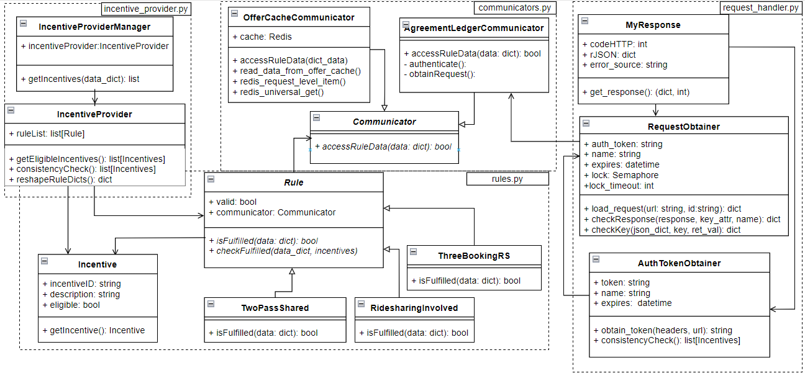

# Incentive provider

This R2R module pre-evaluates the eligibility to receive travel incentives. The incentives 
are associated with travel offers. Current version supports the incentives listed in the following Table:

| Incentive | Description |
|:---------:|-------------|
|     10%Discount     | The incentive is associated with a travel offer item, if at least one ride-sharing leg is included in any travel offer item.       |
|     20%Discount     | The incentive is associated with a travel offer item, if the offer item contains at least one ride-sharing leg and the passenger completed at least three ride-shares. The counter of completed ride-shares is set to zero after allocating the incentive.  |
|      FreeSeat       | The incentive is associated with a travel offer item, if at least one other passenger booked at least one of the ride-shares included in the travel offer item. |

## Calculation of incentives

### Incentive 10%Discount
For a given _request_id_, the corresponding list of travel offer items and the transport modes associated with 
legs are obtained from the [offer-cache](https://github.com/Ride2Rail/offer-cache).
Based on this data, the presence of ride-sharing legs is analysed, in the method _checkFulfilled()_ of the class _RideSharingInvolved_ 
implemented in the script [rules.py](https://github.com/Ride2Rail/incentive-provider/blob/main/codes/rules.py).

### Incentive 20%Discount
For a given _request_id_, the corresponding list of travel offer items, Traveler ID and the transport modes associated with 
legs are obtained from the [offer-cache](https://github.com/Ride2Rail/offer-cache). 
If an offer item contains a ride-sharing leg, Traveler ID is used to request the Agreement Ledger 
module to obtain information about the eligibility to receive 20%Discount incentive. Otherwise, it is concluded that
offer item is concluded to be not eligible for this incentive. The evaluation is implemented by 
the method checkFulfilled()_ of the class _ThreePreviousEpisodesRS_ 
implemented in the script [rules.py](https://github.com/Ride2Rail/incentive-provider/blob/main/codes/rules.py).

### Incentive FreeSeat
For a given _request_id_, the corresponding list of trip leg IDs and the corresponding transport modes are obtained from the [offer-cache](https://github.com/Ride2Rail/offer-cache). 
If an offer item contains a ride-sharing leg, Trip leg ID is used to request the Agreement Ledger 
module to obtain information about the eligibility to receive FreeSeat incentive, and it is outputted. Otherwise, it is concluded that
offer item is concluded to be not eligible for this incentive. The evaluation is implemented by 
the method checkFulfilled()_ of the class _TwoPassShared_ implemented in the script [rules.py](https://github.com/Ride2Rail/incentive-provider/blob/main/codes/rules.py).


# Implementation
Incentive provider module is implemented by classes that are presented in the following figure.
.

## Script [communicators.py](https://github.com/Ride2Rail/incentive-provider/blob/main/codes/communicators.py)
The script implements communicators. A Communicator is a class ensuring interaction with an external service.

### Class Communicator
The class _Communicator_ is an abstract class serving as a common predecessor for classes that implement communication 
with external services.

### Class AgreementLedgerCommunicator
The class _AgreementLedgerCommunicator_ ensures sending of request to the Agreement Ledger. It implements 
reading of urls and of other parameters from the config file [incentive_provider_api.conf](https://github.com/Ride2Rail/incentive-provider/blob/main/codes/incentive_provider_api.conf).
Further, it creates an instance of the class _RequestObtainer_ that ensures execution of requests. 
The request is executed by the method _accessRuleData()_.

### Class OfferCacheCommunicator
The class _OfferCacheCommunicator_ ensures sending of request to the [offer-cache](https://github.com/Ride2Rail/offer-cache).
It reads the host address and port from the config file [incentive_provider_api.conf](https://github.com/Ride2Rail/incentive-provider/blob/main/codes/incentive_provider_api.conf)
and utilizes them to establish a connection with the offer-cache. The request to obtain data from the offer-cache is executed by calling the sequence of 
methods that are implemented by this class. By calling the method _accessRuleData()_, the request to get data from the offer-cache is 
executed. Depended on the level of requested data, methods _read_data_from_offer_cache()_ and _redis_request_level_item()_
are called. The method _read_data_from_offer_cache()_ ensures calling of the method _read_data_from_cache_wrapper()_ from the
package _r2r_offer_utils_ that for a given _request_id_ reads the required attribute values at the levels of offer item and trip leg.
The method _redis_request_level_item()_ reads the required values of attributes at the level of the mobility request.

## Script [AL_requester.py](https://github.com/Ride2Rail/incentive-provider/blob/main/codes/AL_requester.py)
The script implements classes ensuring interaction (authetication and sending of request) with external services (i.e., Agreement Ledger).

### Class AuthTokenObtainer
The class implements acquisition and renewal of the communication token from a login in end-point.
The url and headers need to be provided as parameters.

### Class RequestObtainer
The class executes requests to an external end-point. It reads the parameters of the authentication end-point from the 
configuration file [incentive_provider_api.conf](https://github.com/Ride2Rail/incentive-provider/blob/main/codes/incentive_provider_api.conf).
It creates an instance of the class _AuthTokenObtainer_ that ensures acquisition of the communication token.
The method _load_request()_ executes authentication and the request to the external service. 
The handling and logging of error situations is separated in the method _checkResponse()_.

### Class MyResponse
The class is used to wrap up the response of methods that ensure communication with external services. 
In addition, it takes care of logging the errors, which is the  functionality that is also sometimes used and an instance of the class is created for this purpose.


## Script [rules.py](https://github.com/Ride2Rail/incentive-provider/blob/main/codes/rules.py)
The script implements rules that pre-evaluate eligibility of offer items to be assigned an incentive. 

### Class Rule
This class is a common predecessor of classes that implement rules. It is expected that every rule will be implemented 
by a class inherited from the class _Rule_. The pre-evaluation is implemented by the method _checkFulfilled()_.

### Class TwoPassShared
The class pre-evaluates the eligibility to receive the _FreeSeat_ incentive. 

### Class RideSharingInvolved
The class pre-evaluates the eligibility to receive the _10%Discount_ incentive. 

### Class ThreePreviousEpisodesRS
The class pre-evaluates the eligibility to receive the _20%Discount_ incentive. 

### Class Incentive
The class maintains the results of a rule evaluation for later use, e.g., for the consistency check or for the final 
output of results. An instance of the class _Incentive_ is created for every offer item and every type of incentive,


## Script [incentive_provider.py](https://github.com/Ride2Rail/incentive-provider/blob/main/codes/incentive_provider.py)
The script implements upper layer of the Incentive provider module.  It takes care of the initialization of rules that 
are applied in the pre-evaluation process and initialization of the incentives. The script implements the way how the 
rules are applied and the consistency check that ensures that only mutually compatible incentives are returned for each 
offer item.

### Class IncentiveProvider
The class _IncentiveProvider_ implements the method _getEligibleIncentives()_ that executes each rule on 
each offer item, the method _consistencyCheck()_ that implements the constraints defining the mutual compatibility 
of incentives. Currently, to demonstrate this functionality the incentives _10%Discount_ and _20%Discount_ are considered to 
be mutually incompatible and if rules assigned both these incentives to a single offer item, during the consistency 
check the eligibility for _10%Discount_ is cancelled.


### Class IncentiveProviderManager
The class _IncentiveProviderManager_ ensures correct initialization of the Incentive provider and implements the 
method _getIncentives()_ that calls the methods implemented by the class _IncentiveProvider_ to execute the pre-evaluation 
of incentive eligibility.

# Usage

## Local development (debug on)
The module "Incentive provider" can be launched locally from the terminal by running the script "incentive_provider_api.py":
```bash
2022-01-17 11:29:45 - incentive_provider_api - INFO - config loaded successfully
 * Serving Flask app 'incentive_provider_api' (lazy loading)
 * Environment: development
 * Debug mode: on
 * Running on http://127.0.0.1:5011/ (Press CTRL+C to quit)
```
The incentive provider was configured to run by default on the port _5011_. 

## Docker environment
1. Go to the incentive-provider directory and build the docker image
```bash
$ docker-compose build 
```

2. Run the docker container 
```bash
docker-compose up 
```

```bash
Starting incentive-provider ... done
Attaching to incentive-provider
incentive-provider    |  * Serving Flask app 'incentive_provider_api.py' (lazy loading)
incentive-provider    |  * Environment: production
incentive-provider    |    WARNING: This is a development server. Do not use it in a production deployment.
incentive-provider    |    Use a production WSGI server instead.
incentive-provider    |  * Debug mode: off
incentive-provider    | 2022-01-27 07:10:51 - incentive_provider_api - INFO - config loaded successfully
incentive-provider    |  * Running on all addresses.
incentive-provider    |    WARNING: This is a development server. Do not use it in a production deployment.
incentive-provider    |  * Running on http://172.18.0.4:5000/ (Press CTRL+C to quit)
```

Please note that incentive-provider container connects to the docker network trias-extractor_offer-enhancer-net. 
to be able to communicate with other modules.  Hence, this network must be established prior to running the incentive-provider 
container.  Such network is created when the trias-extractor is launched in the docker environment. 


## Requesting Incentive provider
Example of the curl command to receive a JSON file with information about the incentives associate with the travel offers included in the request which is identified by  < request_id >:
```bash
curl -X GET "http://127.0.0.1:5011/incentive_provider/?request_id=< request_id >"
```

Example of the returned JSON file:


```JSON
{
    "36e5c5b9-b434-40c4-8017-9ec79578813a": {
        "10discount": true,
        "trainSeatUpgrade": true,
        "20discount": false
    },
    "ef9012a8-918b-4e20-a724-rs1": {
        "10discount": true,
        "trainSeatUpgrade": true,
        "20discount": false
    },
    "731d2c82-e158-4d87-8cd6-df9bbcc647e6": {
        "10discount": false,
        "trainSeatUpgrade": false,
        "20discount": false
    },
    "5c08395c-7efc-4418-a2dc-c2794e7120f6": {
        "10discount": true,
        "trainSeatUpgrade": true,
        "20discount": false
    },
    "c421d948-8741-4b33-8797-3871ec8b3b7f": {
        "10discount": false,
        "trainSeatUpgrade": false,
        "20discount": false
    }
* Closing connection 0
(base)
```

## Response
The Incentive provider returns the JSON file as exemplified in the 
Section Requesting Incentive provider. If the request is successfully processed,
The JSON file contains for each offer, identified by the offer ID, a list of all incentives 
and the value "true" or "false" indicating the result of the 
incentive eligibility pre-evaluation.

For the correct functionality of the Incentive provider the
functional connection to the Offer-cache component is essential. So if there 
is no information associated with the provided _request_id_ in the 
Offer-cache or if the connection to the Offer cache is not functional 
the Incentive Provider together with the HTTP code 200 returns 
the following JSON file:
```JSON
"offers": {
    "no_offer": {
        "10discount": false,
        "trainSeatUpgrade": false,
        "20discount": false
    }
}, 660-1326-4b6b-bf00-132ec7e576de"
* Closing connection 1
}(base) 
```  

In a case, if the authentication or a request to the Agreement Ledger fails, the eligibility to receive the corresponding incentives is set to "false"
and the HTTP status code  200 is returned. The information about the experienced errors is reported to the standard output and logged to the file [error.log](https://github.com/Ride2Rail/incentive-provider/blob/main/error.log).

# Limitations
* The communication with the Agreement Ledger could be run in parallel to improve the response. However, the preliminary 
experiments showed favorable response times of the Agreement Ledger and thus there was no need to further optimise the code.

